# How to Build A CI CD Pipeline

# Overview

This project will start with creating a scaffolding to assist in performing Continuous Integration and Continuous Delivery. And then it will use Github Actions along with a Makefile, requirements.txt and application code to perform an initial lint, test, and install cycle. Lastly, we will integrate this project with Azure Pipelines to enable Continuous Delivery to Azure App Service.

## Project Plan

### Trello board

https://trello.com/b/Ua1O1dSn/create-ci-cd-pipeline

### Spreadsheet Project Plan

https://docs.google.com/spreadsheets/d/10TB6OXX8196cBgYHUD4E6tcd--r-CuljEN8CGN7dNSU/edit?usp=sharing
## Architectural Diagram
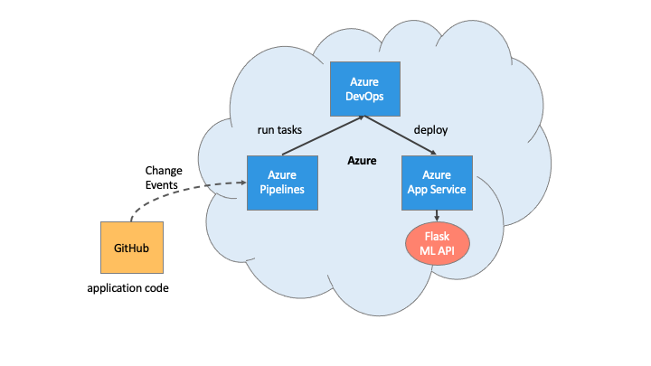

## CI: Set Up Azure Cloud Shell

### 1: Create the Cloud-Based Development Environment

:white_check_mark: Create a Github repository

:white_check_mark: Launch an Azure Cloud Shell environment and create ssh-keys. Upload these keys to your GitHub account.

**Steps:**

- Go to Azure Portal and  Click Azure Cloud Shell
- Type `ssh-keygen -t rsa` to generate a key

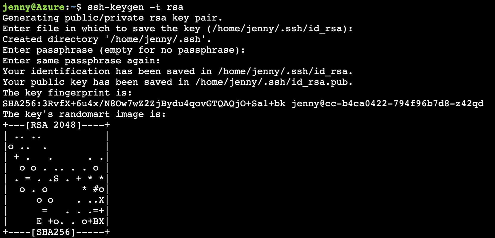

- Type `cat /home/jenny/.ssh/id_rsa.pub` to generate the key.
- Copy the generated key and go to GitHub. Click the settings and paste the key.

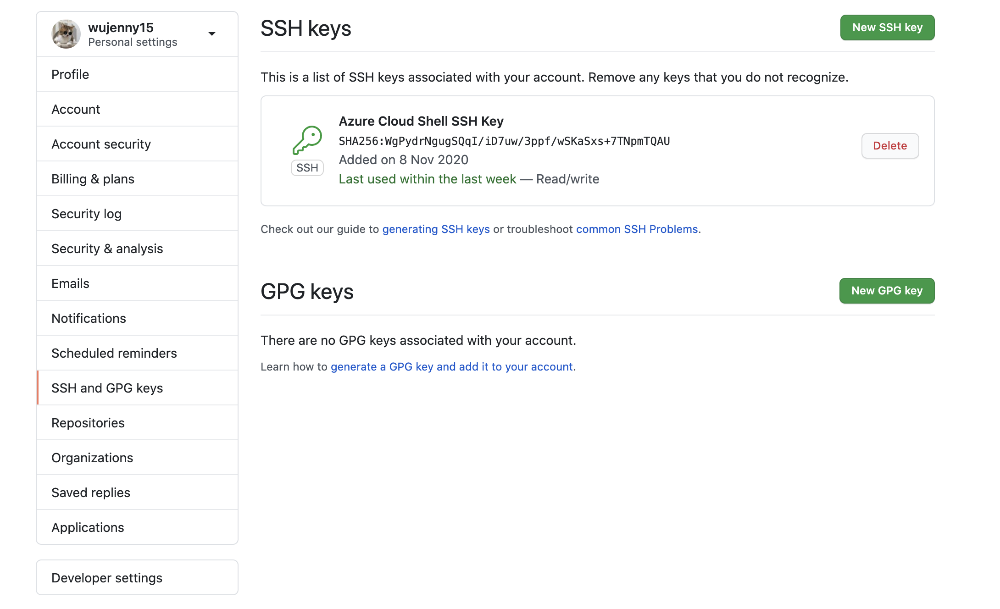

### 2. Create Project Scaffolding

The environment is set up, we can create the scaffolding for our project and test our code.

**Create the Makefile**

Create a file named Makefile and copy the below code into it. (Remember to use tab formatting). Makefile is a handy way to create shortcuts to build, test, and deploy a project.

```makefile
install:
    pip install --upgrade pip &&\
        pip install -r requirements.txt

test:
    python -m pytest -vv test_hello.py

lint:
    pylint --disable=R,C hello.py

all: install lint test
```

**Create requirements.txt**

Create a file named requirements.txt. A requirements.txt is a convenient way to list what packages a project needs. Another optional best practice would be to "pin" the exact version of the package you use.

```
pylint
pytest
```

**Create the Python Virtual Environment**

You can create a Python virtual environment both locally and inside your Azure Cloud Shell environment. By creating the virtual environment in a home directory it won't accidentally be checked into your project.

```bash
pip install virtualenv
virtualenv ~/.udacity-devops
source ~/.udacity-devops/bin/activate
```

I  created the `.udacity-devops` virtual environment in my mac, so I will simply activate it. You can check whether which python are we using by tying `which python` in your terminal.

```bash
source ~/.udacity-devops/bin/activate
```

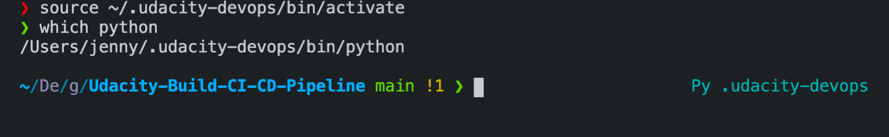

**Create the script file and test file.**

The next step is to create the script file and test file. This is a boilerplate code to get the initial continuous integration process working. It will later be replaced by the real application code.

First, you will need to create [hello.py](http://hello.py/) with the following code at the top level of your Github repo:

```python
def toyou(x):
    return "hi %s" % x

def add(x):
    return x + 1

def subtract(x):
    return x - 1
```

Next, you will need to create test_hello.py with the following code at the top level of your Github repo:

```python
from hello import toyou, add, subtract

def setup_function(function):
    print("Running Setup: %s" % function.__name__)
    function.x = 10

def teardown_function(function):
    print("Running Teardown: %s" % function.__name__)
    del function.x

### Run to see failed test
#def test_hello_add():
#    assert add(test_hello_add.x) == 12

def test_hello_subtract():
    assert subtract(test_hello_subtract.x) == 9
```

### 3. Local Test

Now it is time to run `make all` which will install, lint, and test code. This enables us to ensure we don't check in broken code to GitHub as it installs, lints, and tests the code in one command. Later we will have a remote build server perform the same step.

What is important to keep in mind is that we need to test our code locally first before we clone it to the Azure Cloud Shell. So I will install all the packages and test whether I can run the app.py application and make housing prediction successfully in my local machine first. 

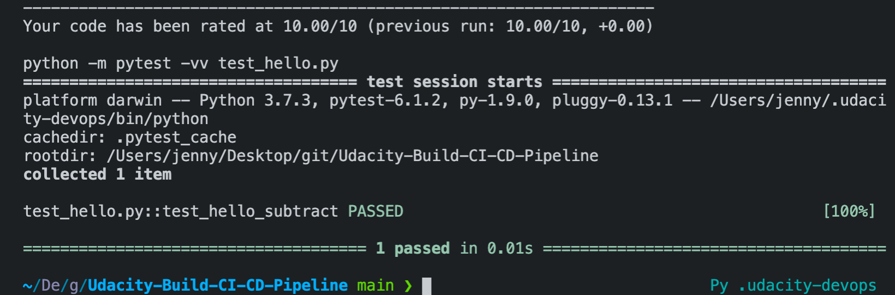

After running my tests locally, I want to run my python web application. Once it is successfully, you will see Sklearn Prediction Home in your browser.

```python
Python app.py
```

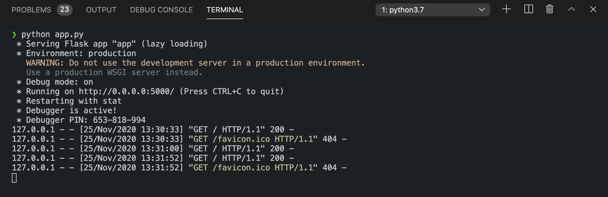

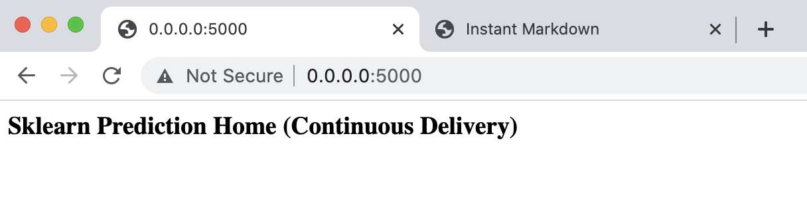

Then, we want to make sure whether we call call our ML API. Open another terminal and type `./make_prediction.sh` in our terminal. We will be able to see the prediction.

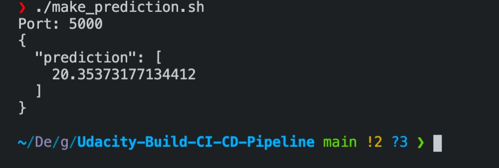

Since we got the prediction value, it means our application works perfectly on our localhost. Then we will modify the port in app.py to 443 and commit our changes to the repo. 

### 4. Clone Project into Azure Cloud Shell

Go to Azure Portal, click the Azure CLI, and clone the project. And we can do the same steps like above in our Azure Cloud Shell.

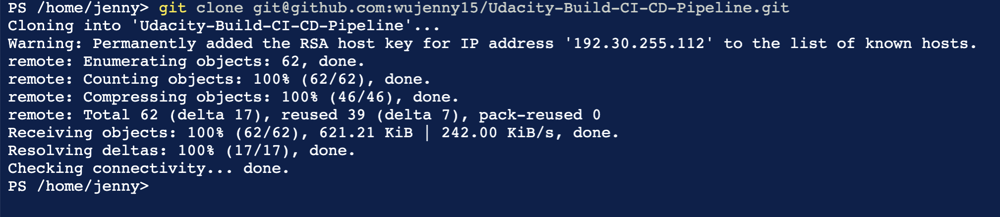
## CI: Configure GitHub Actions

### Replace yml code
```yaml
name: Python application test with Github Actions

on: [push]

jobs:
  build:

    runs-on: ubuntu-latest

    steps:
    - uses: actions/checkout@v2
    - name: Set up Python 3.5
      uses: actions/setup-python@v1
      with:
        python-version: 3.5
    - name: Install dependencies
      run: |
        make install
    - name: Lint with pylint
      run: |
        make lint
    - name: Test with pytest
      run: |
        make test
```
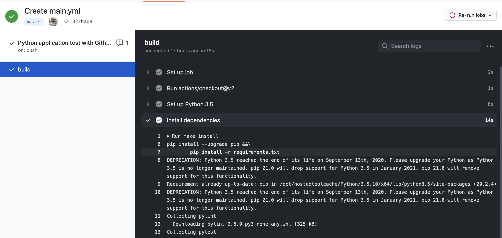
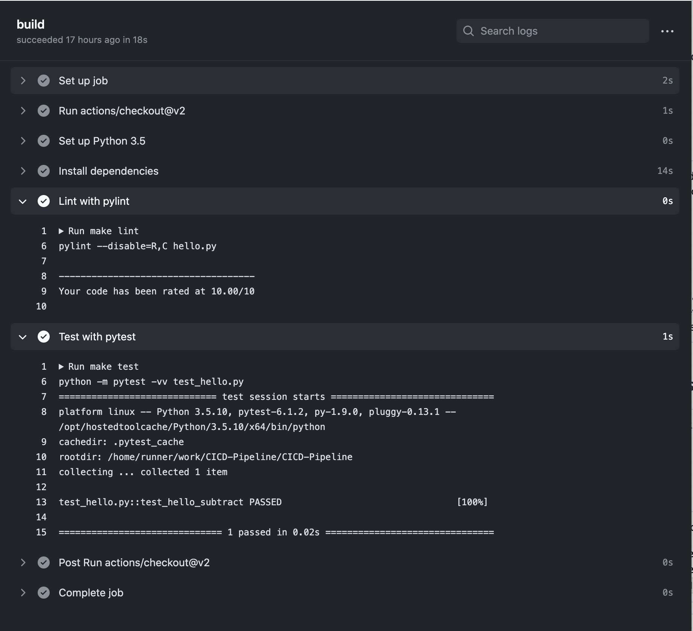
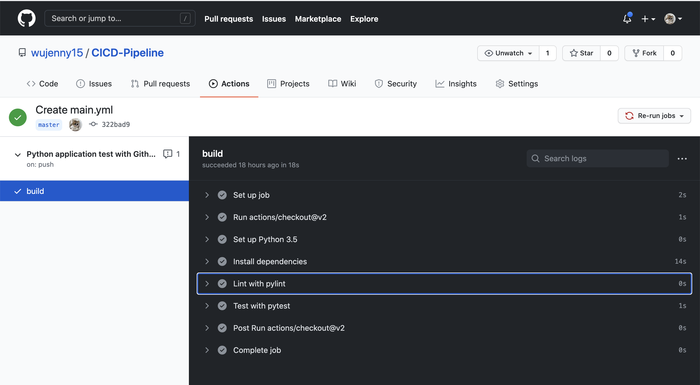

## Continuous Delivery on Azure

This part will involve setting up Azure Pipelines to deploy the Flask starter code to Azure App Services. After we have enabled the source control integration, we can select the Azure Pipelines to build provider, and then configure the App Services permissions.
### Load Test with locust

```
locust
```

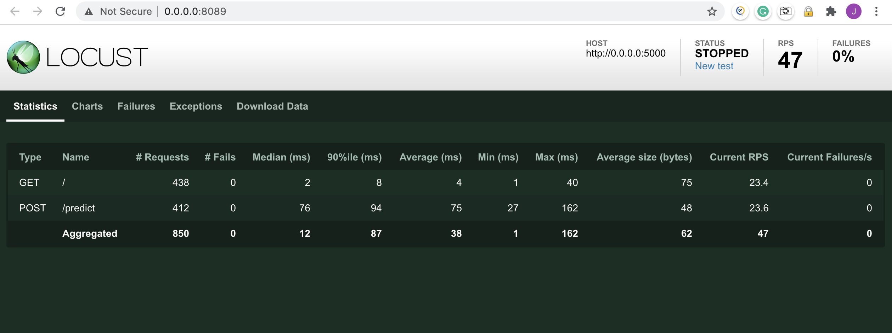
### 1. Authorize Azure App Service

Azure App Service is like our localhost but it is hosted in Azure. It is like a black-box localhost. Azure APP service is PaaS so we do not need to set up and maintain the Virtual Machines.It is easy to use. 

To start with, we need to authorize Azure APP Service. You can create a APP Service from Azure Portal or in the Azure Cloud Shell. I will use the Portal here since it is more clear and easy for me to understand. Alternatively, you can use the script below to set up a Azure App Service in the Azure Cloud Shell.

```bash
az webapp up -n <your-appservice>az webapp config set -g <your-resource-group> -n <your-appservice> --startup-file <your-startup-file-or-command>
```

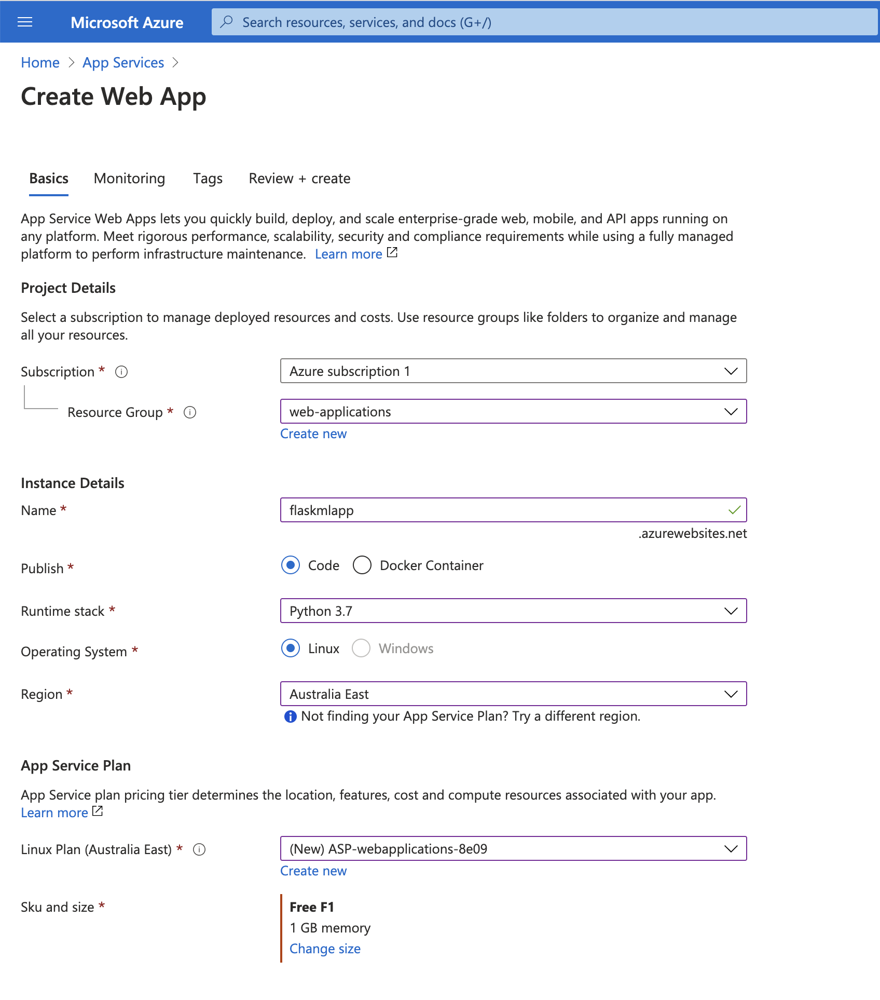

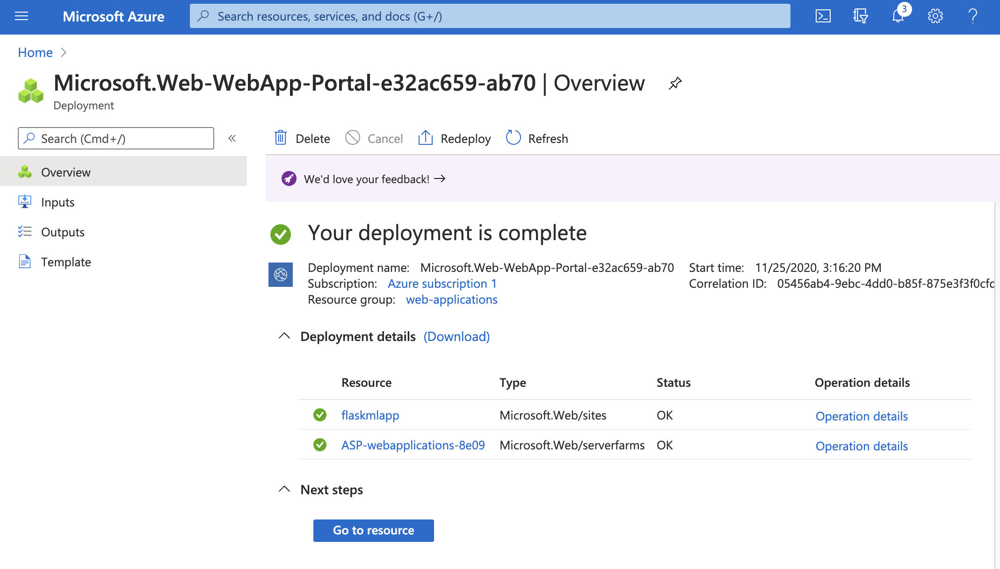

## 2. Enable Continuous Deployment with Azure Pipelines

Then we want to use Azure pipelines to deploy our flask ML web application. To do so, we need to create a Azure DevOps Project and then establish a service connection for Azure Pipelines and Azure App Service first. 

Here is the tutorial you can follow along.

[Use CI/CD to deploy a Python web app to Azure App Service on Linux](https://docs.microsoft.com/en-us/azure/devops/pipelines/ecosystems/python-webapp?view=azure-devops&WT.mc_id=udacity_learn-wwl)

After that, the Flask ML Web Application is deployed successful with Azure Pipelines. 

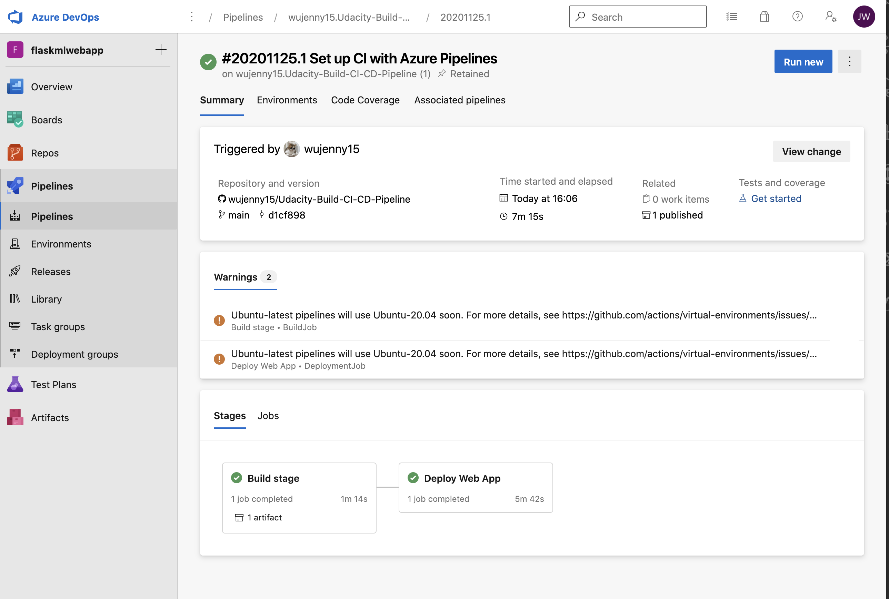

Go to the App Service, and click the URL under the Essentials , we should be able to visit the website now. 


**Verify Prediction with starter code file**

Open Azure Cloud Shell, and go to our project directory. Run the `make_predict_azure_app.sh`

in the CLI. Remeber to modify your app name.

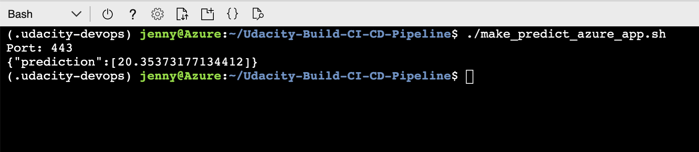

### 3. Enable GitHub and Azure Pipelines

Now that we have set up the Azure Pipelines and deploy the Flask ML application on Azure, we want to make sure when we make any changes on our GitHub Repo, the Azure Pipelines will be triggered. The piplelines will run and the applications will automatically deployed to Azure App Service.

I have modified the heading for my web application. When I commit the changes to GitHub, the Azure Pipleines will be triggered and it will deploy my new changes to the App Service.

```python
@app.route("/")def home():    
	html = "<h3>Sklearn Prediction Home (Continuous Delivery Test)</h3>"    
	return html.format(format)
```

To do this, we need to tell Azure Pipeline what are the triggers. Whether we want to deploy the web applications when we have made any changes  or when we create a Pull Request and merge our changes to the master branch. 

To make it simple here, I just want to tell the Azure Pipeline to deploy the web applicatios when I have made any changes on my branch. You can always modify it to be triggered by a PR.

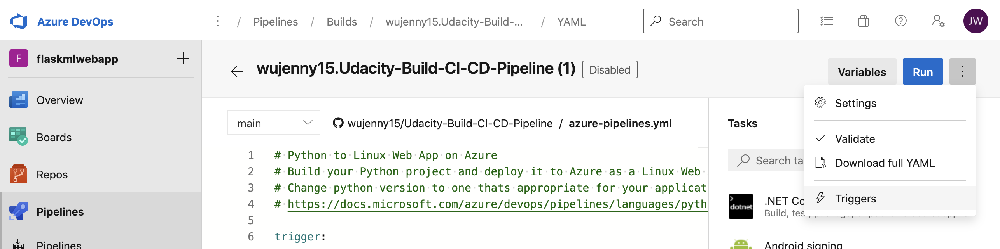

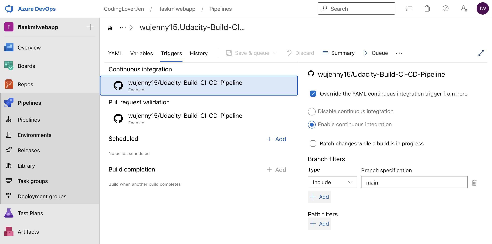

### **4. Stream Logs**

Here is the output of streamed log files from deployed application.

https://flaskmlapp.scm.azurewebsites.net/api/logs/docker

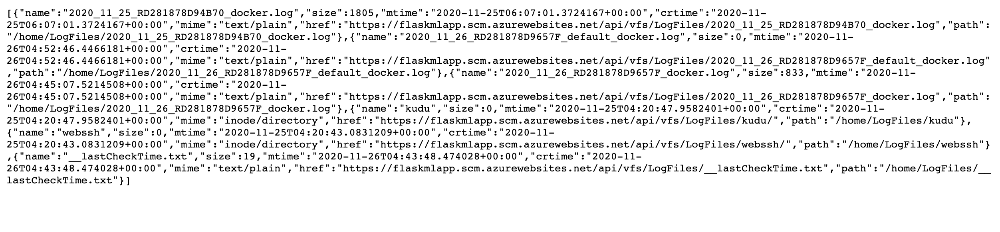
View the log file in App Service - Log Stream

## Enhancements

- This project can be enhanced by using the GitHub actions to deploy the web applications. We can utilize GitHub Actions as well as Azure Pipelines for continous delivery. Also, we can modify the pipeline and only triggers when there is a Pull Request.
- Also, the whole process can be applied for other frameworks such as C# or Node.js.

## Demo

https://www.youtube.com/watch?v=p5jgTdOToW0


